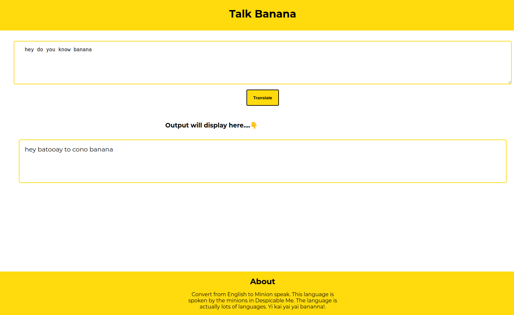

# Banana-transltion-webapp

1. A fun translation app developed using Vanilla JS. Translates English language to Minions language. 

## Tech used
1. HTML
2. CSS
3. JavaScript

[Link to the site.](https://banana-translation-webapp.netlify.app/)

### Screenshot

